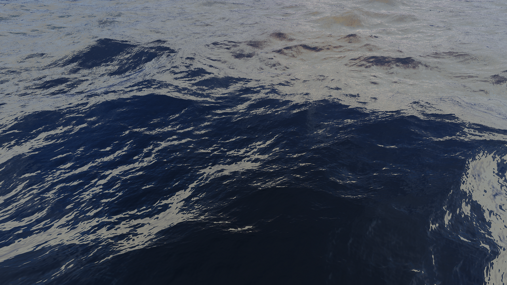
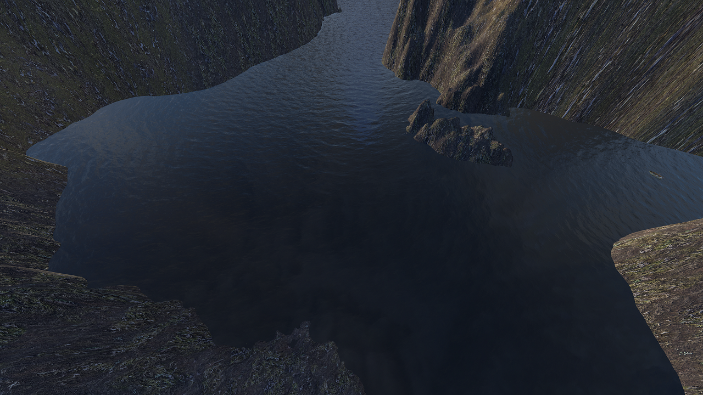
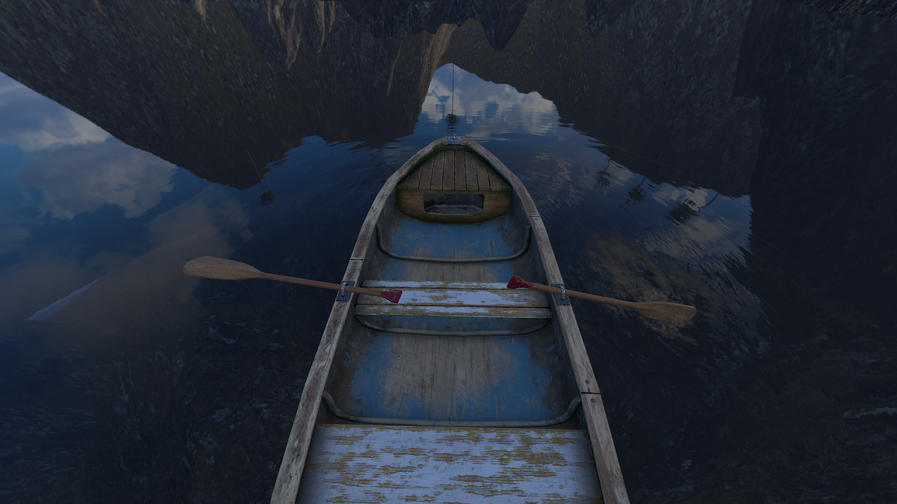
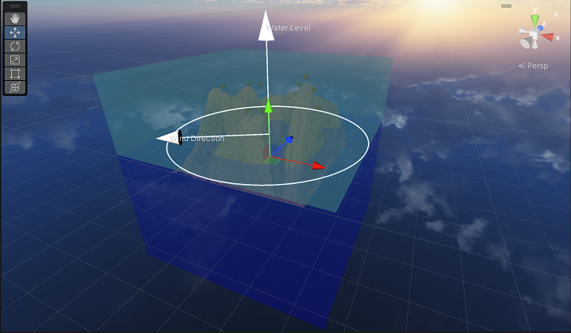
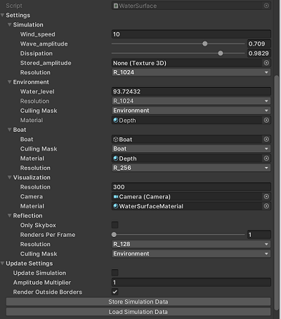

# Water Surface Wavelets
Unity Package for interactive water surfaces.

## Features
### **Realistic Rendering**

Waves are rendered as trochoidal waves using a spectrum input.

### **Environment-aware Simulation** 


Waves take their shape based on the environment. This can be simulated in the Editor or in the build, in real-time.
### **Interactive Simulation**


The public API allows you to generate real-time disturbances at Runtime, used for the oar waves and the boat wake in the above image.

## Supported Platforms
### Win, Mac, Linux :heavy_check_mark: 
Developed and tested on Win64 and DX11/12. All other desktop platforms and APIs should work but have not been tested.

### Android, iOS ✔️
Builds are possible, though code has been developed and optimized only for desktop build targets.

### WebGL ❌
WebGL does not support Compute Shaders. The simulation, which is the main component that relies on Compute Shaders, can be extended with a CPU/Unity Jobs implementation to support WebGL.

## Supported Rendering Pipelines
* Built-In (Standard) ✔️
* URP ❌
* HDRP ❌

## Supported Editor Versions
* Unity 2022 LTS ✔️
* Unity 2021 LTS ✔️

## Performance

❗ The following measurements are indicative only.  


Hardware used for measurements:

* GPU: NVIDIA RTX 2080 Super, 8GB DDR6.
* Processor: Intel Core i9-10980HK @ 2.4GHz
* RAM: 32GB

|            Resolution         | FPS       |   Scene |
| --------------------| --------------------| --------------- |
| Full HD (1920 x 1080)| ~80 | Demo Scene* |
| WXGA (1366 x 768) | ~105| Demo Scene* |
| QHD (2560 x 1440) | ~55 | Demo Scene* |
| 4K UHD (3840 x 2160) | ~33| Demo Scene*|

\* Demo Scene video: https://www.youtube.com/watch?v=pmVNWkjJeK8


## Installation
Install via the package manager. See https://docs.unity3d.com/Manual/upm-ui-giturl.html

## Usage
### 1. Creating a new surface
Create a new surface by clicking on ***GameObject/WaterSurfaces/Create Water Surface*** on the toolbar menu.

### 2. Scene Window

1. Use the default transform gizmos to move, rotate and scale the simulation volume, so that it encapsulates your terrain.
2. Use the water level gizmo to control the height of the water.
3. Use the wind direction gizmo to control the main direction of the waves. 


### 3. Inspector Window


Use the inspector to configure rendering and simulation parameters.

#### Simulation
The simulation creates a 3D texture that captures the amplitude of the waves in different parts of the surface. The amplitude texture can be updated on every frame, during gameplay.

- *Wind Speed* - The speed by which the waves propagate during the simulation.
- *Wave Amplitude* - The default wave amplitude used during the simulation.
- *Dissipation* - The rate by which the waves created by the user interactions, lose their energy. A value of 1 will conserve all energy.
- *Stored Amplitude* - An optional amplitude texture that can be used to initialize the simulation.
- *Resolution* - The amplitude texture resolution.

#### Environment
The simulation takes the environment into account. A heightmap of the environemnt is created once at Start and is used during the simulation.
- *Water Level* - The height of the water, in global coordinates.
- *Resolution* - The resolution of the environment heightmap.
- *Culling Mask* - Layers that the camera should render when capturing the environment height map.
- *Material* - The depth material used to capture the depth values of the environment height map.

#### Boat (optional)
To avoid rendering issues where the water surface penetrates the boat that the camera is standing on, we generate a heightmap of the boat hull.

- *Boat* - The gameobject that has the transform of the boat and the MeshRenderer of the boat.
- *Culling Mask* - Layers that the camera should render when capturing the boat height map.
- *Material* - The depth material used to capture the depth values of the boat height map.
- *Resolution* - The resolution of the boat heightmap.

#### Visualization
When rendering, we create a grid in the x-z plane and we sample its y values from the simulation data.
- *Resolution* - The resolution of the projected grid.
- *Camera* - The camera that renders the surface.
- *Material* - The material to render the surface with.

#### Reflection
To render the reflections of the environment on the water, we render the environment into a cubemap in realtime.
- *Only Skybox* - Render only the Skybox?
- *Renders Per Frame* - How many maps from the cubemap should be rendered on each frame.
- *Resolution* - The resolution of the reflection cubemap.
- *Culling Mask* - Layers that the camera should render when capturing the reflections.

#### Update Settings
Settings that can be changed during gameplay.
- *Update Simulation* - Should the simulation be updated in this frame?
- *Amplitude Multiplier* - Modify the amplitude, only when rendering (not in simulation).
- *Render Outside Borders* - Should we render the surface as an infinite ocean?

#### Store/Load Simulation Data (Editor only)
Store/Load the current state of the simulation, during Play Mode.

### Start Rendering/Simulation
Press the Play button on the Editor to go into Play Mode or create and run a build.

### 4. API
You can use the public API to disturb the water surface.

 ```csharp
        /// <summary>
        /// Add disturbance at a point in all directions
        /// </summary>
        /// <param name="pos">global coordinates on the x-z plane</param>
        /// <param name="value">intensity of distrurbance</param>
public void AddPointDisturbance(Vector2 pos, float value)

        /// <summary>
        /// Add disturbance at a point with a specific direction
        /// </summary>
        /// <param name="pos">global position coordinates</param>
        /// <param name="direction"> direction of the distrurbance in global coordinates</param>
        /// <param name="value">intensity of distrurbance</param>
        /// <param name="sideDirections"> generate waves in directions next to the main direction</param>
 public void AddPointDirectionDisturbance(
            Vector3 pos, 
            Vector3 direction, 
            float value, 
            bool sideDirections = false)
 ```
## Credits

This work started as a GPU implementation of [1] and more precisely, as a Unity port of [2]. On top of that work, the simulation code was ported to Compute Shaders and extra tooling and new features were added.

In the early stages, when working with native code from [2], there were a few issues when building on windows. I used [3] which is a fork of [2], that resolves those issues. 
### References
[1] Stefan Jeschke, Tomáš Skřivan, Matthias Müller-Fischer, Nuttapong Chentanez, Miles Macklin, and Chris Wojtan. 2018. Water surface wavelets. ACM Trans. Graph. 37, 4, Article 94 (August 2018), 13 pages. https://doi.org/10.1145/3197517.3201336

[2] https://github.com/lecopivo/WaterSurfaceWavelets

[3] https://github.com/speps/WaterSurfaceWavelets
